<h2 align="center">👋 Welcome to my GitHub profile!</h2>

  

<table align="center">
  <tr>
    <td valign="top" width="50%">
      
    </td>
    <td valign="top" width="50%">
      
    </td>
  </tr>
</table>

  

---

### About Me

Hi 👋, I'm a hobbyist developer based in  <strong>Norway</strong>.

- 📰 Owner and creator of [NewsTargeted.com](https://NewsTargeted.com)
- 💻 I work with PHP, JavaScript, MySQL, HTML, CSS, Lua, Python, and more.
- 🛠️ I use Node.js, Docker, TypeScript, Discord.js, and other modern tools.
---

### 🌐 Web Development Services

I offer custom website development for individuals and small businesses!  
- **Affordable pricing** - I don't charge much for website creation.
- **Domain not included** - You'll need to purchase your own domain.
- **Modern, mobile-friendly, and SEO-optimized sites.**
- **Technologies:** PHP, MySQL, JavaScript, HTML, CSS, CMSMS, and more.

**Interested?**  
Contact me on Discord for a chat about your needs and pricing:  
[Join my Discord server](https://discord.gg/nx9Kzrk)

---

### 🚀 NewsTargeted.com Services

Explore the various services and tools available on NewsTargeted.com:

  
  
  
  
  
  
  
  
  
  
  
  
  
  
  

**Quick Links:**
- 🔗 [API Service](https://api.newstargeted.com/) - RESTful API endpoints
- 🔄 [Convert Service](https://convert.newstargeted.com/) - File and data conversion tools
- 📊 [Dashboard](https://dashboard.newstargeted.com/) - Analytics and monitoring dashboard
- 🏥 [Diabetes Service](https://diabetes.newstargeted.com/) - Health tracking and management
- 💬 [Discord Service](https://discord.newstargeted.com/) - Discord integration tools
- 🔌 [Extensions](https://extensions.newstargeted.com/) - Browser extensions and add-ons
- 📺 [Info Screen](https://infoskjerm.newstargeted.com/) - Information display system
- 🪟 [MAS Service](https://mas.newstargeted.com/) - Master3395's Administration Service for Roblox moderation
- 💾 [Raw Data](https://rawdata.newstargeted.com/) - Data access and export
- 🪝 [Webhook Service](https://webhook.newstargeted.com/) - Webhook management and testing
- 📚 [Classroom](https://classroom.newstargeted.com/) - Classroom monitoring and educational tools
- 🎮 [Games](https://games.newstargeted.com/) - Browser games and simulators
- 📈 [RBXStats](https://rbxstats.newstargeted.com/) - Roblox statistics and analytics
- ✅ [Status](https://status.newstargeted.com/) - Service status and uptime
- 🔗 [YOURLS](https://yourls.newstargeted.com/) - Short URL service

---

### 🤖 Discord Bot

Check out my Discord bot available in the Discord App Directory:

  

[**Add NT Bot to your server**](https://discord.com/discovery/applications/463029380751556610) - Available in Discord App Directory

---

### 📫 Connect with Me

  
  
  
  
  
  

---

### 🛠️ Technologies & Tools

  
  
  
  
  
  
  
  
  
  
  
  
  

---

  <b>Let's build something great together!</b>

